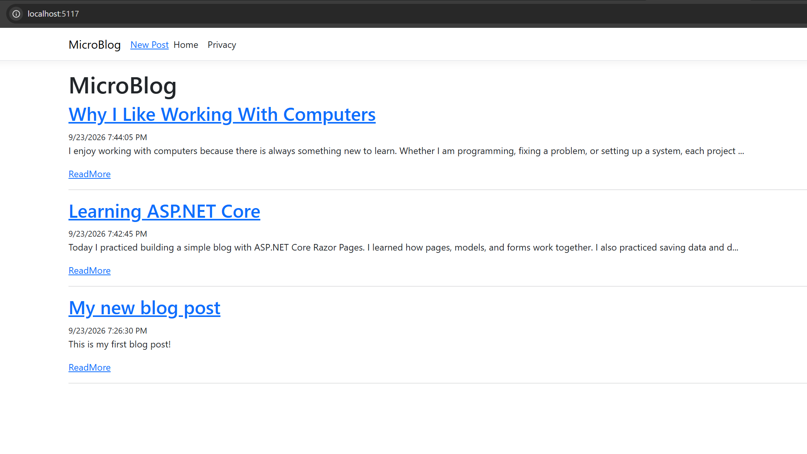
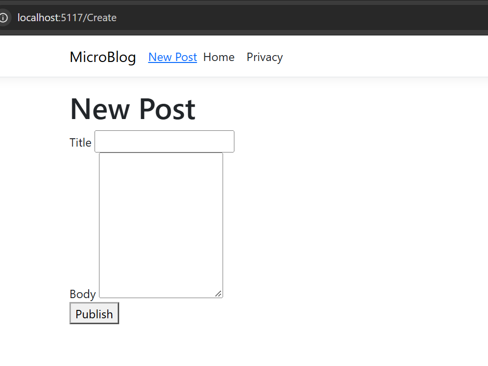
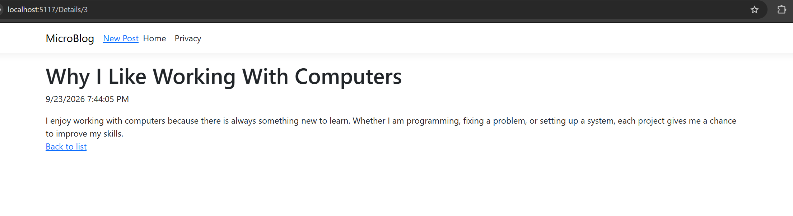

# MicroBlog

## Description

MicroBlog is a simple ASP.NET Core Razor Pages application for creating and viewing blog posts. Posts are saved to a JSON file so they remain available after the application is restarted.

## Features

- Create new blog posts with a title and body
- View all posts on the Index page
- View individual posts on a Details page
- Store posts in `data/posts.json`
- Uses a shared layout and navigation bar
- Uses the `_PostCard` partial view to display post summaries

## How to Run

1. Open the project in Visual Studio.
2. Build and run the project.
3. Open the local address shown by ASP.NET Core.
4. Use **New Post** to create a blog post.
5. Use **ReadMore** to view the Details page for a post.

## Screenshots

### Index Page

### Create Page

### Details Page

